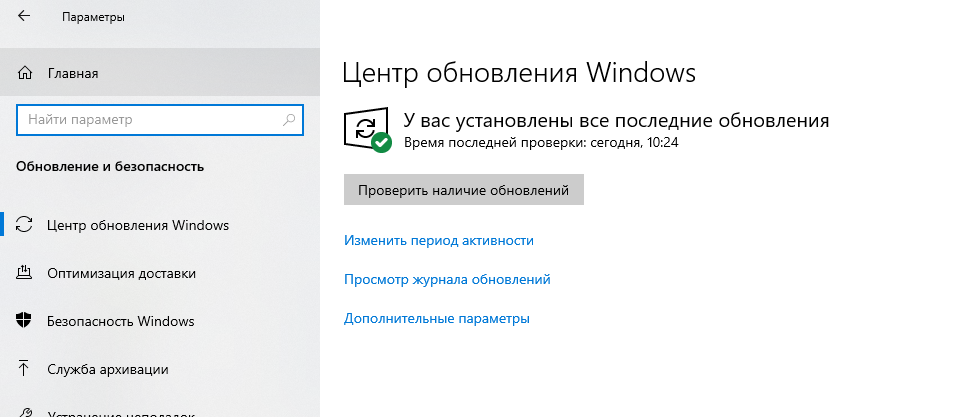
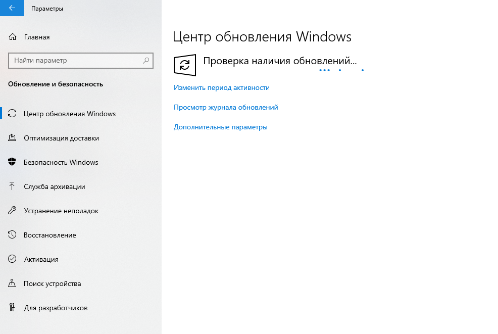
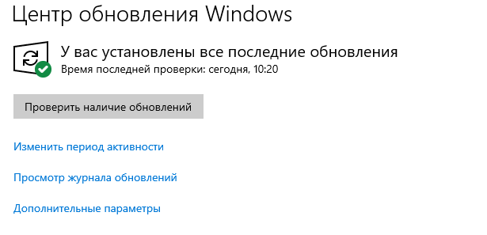
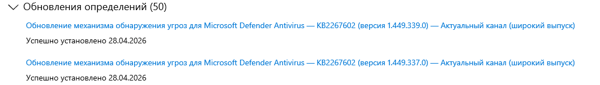
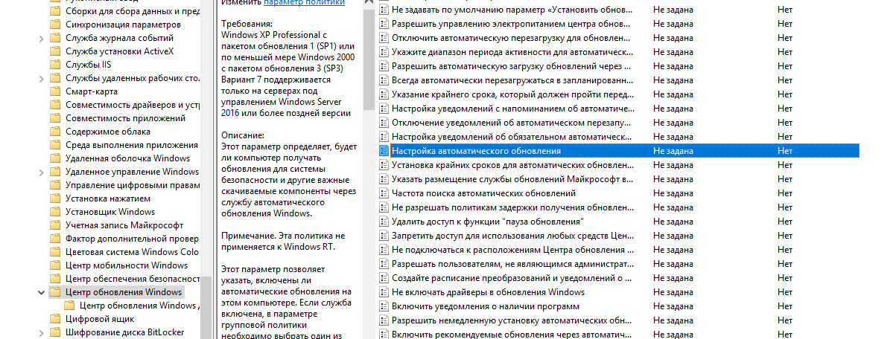
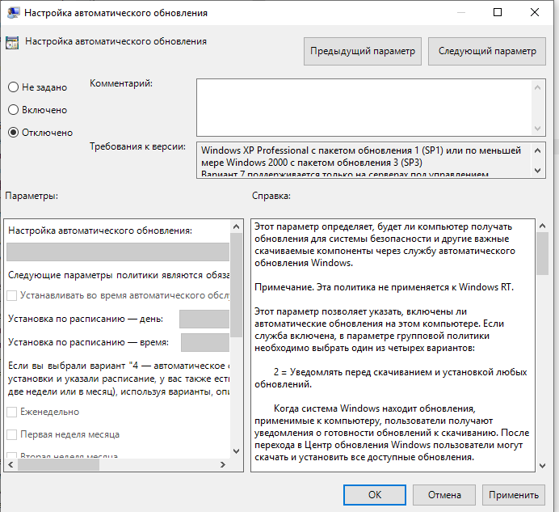
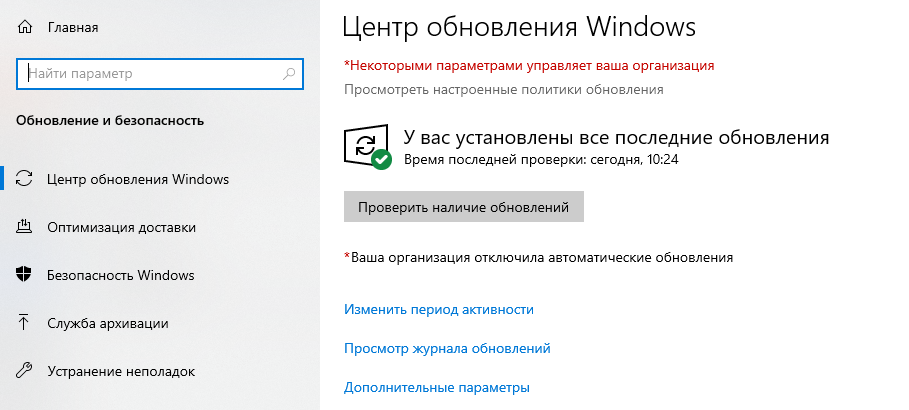
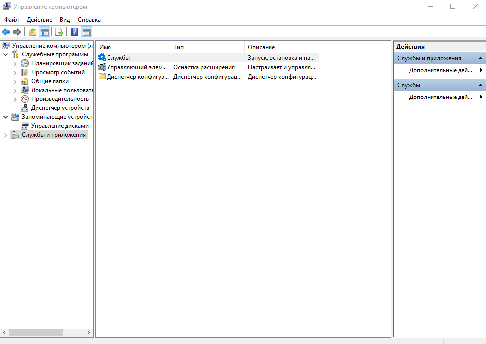
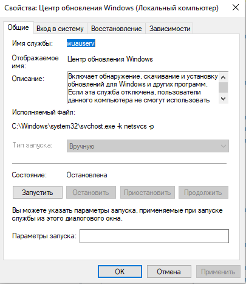
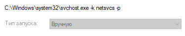

# Лабораторная работа №15
## Установка и настройка центра обновления Windows

**Цель работы:** Изучить принципы настройки и обновления ОС Windows.

---

## Теоретические сведения

Обновления делятся на важные, рекомендуемые, необязательные и основные.

| Тип обновления | Описание |
|----------------|----------|
| **Важные обновления** | Обеспечивают значительное улучшение защиты, безопасности и надежности компьютера. Устанавливаются автоматически. |
| **Рекомендуемые обновления** | Касаются некритических проблем, улучшают работу компьютера. Могут устанавливаться автоматически. |
| **Необязательные обновления** | Драйверы и другие программы от Microsoft, улучшающие работу компьютера. Устанавливаются вручную. |

**Типы обновлений по версии Windows Update:**

- **Обновление безопасности** — исправление уязвимостей (критическая, важная, средняя, низкая степень опасности)
- **Критические обновления** — исправление ошибок, не связанных с безопасностью
- **Пакеты обновлений (Service Pack)** — наборы исправлений, обновлений безопасности, изменений в дизайне и функциональности

---

## Ход выполнения работы

### 1. Настройка Центра обновления Windows 10

**Путь:** Пуск → Параметры → Обновление и безопасность

**Проверка наличия обновлений:**

> ⚠️ *Если центр обновления выдает ошибку — проверьте подключение виртуальной машины к интернету*

**Результаты:**

- **Обязательные (важные) обновления:** `Обновление механизма обнаружения угроз`

**Установка обновлений:**

Дождались загрузки и установки обновлений.

**Журнал обновлений:**

*Зафиксировано:* `KB2267602 28.04.2026`

---

### 2. Отключение обновлений Windows 10

1. Нажать `Win+R`, ввести `gpedit.msc`
2. Перейти по пути: **Конфигурация компьютера → Административные шаблоны → Компоненты Windows → Центр обновления Windows**
3. Найти пункт **«Настройка автоматического обновления»** → дважды кликнуть

4. Установить значение **«Отключено»**

5. Нажать «ОК», закрыть редактор

**Результат в Центре обновления после изменений:**

---

### 3. Установка обновлений вручную из сетевой папки

В проводнике виртуальной машины ввести путь: `\\kbastrikin`

![Содержимое папки]

Скопировать обновления из папки «Обновления к установке» и установить их вручную.

**Определение типа обновлений** через сайт: [catalog.update.microsoft.com](http://www.catalog.update.microsoft.com)

![Поиск обновления]

**Результаты (заполнить после выполнения):**

| Номер обновления | Классификация | Версия ОС | Размер |
|------------------|---------------|-----------|--------|
| KB`[номер]` | `[тип]` | Windows 10 | `[размер]` |
| KB`[номер]` | `[тип]` | Windows 10 | `[размер]` |

---

### 4. Настройка службы Центра обновления

1. **Путь:** Панель управления → Администрирование → Управление компьютером → Службы и приложения → Службы

2. Найти службу **«Центр обновления Windows»** (wuauserv) → открыть **Свойства**

3. На вкладке **Общие** установить: **Тип запуска: Вручную**

4. На вкладке **Восстановление** установить параметры по образцу:

![Восстановление]

5. Настроить параметры перезагрузки ПК:

![Параметры перезагрузки]

6. Нажать «ОК», сохранить настройки

---

### 5. Результат выполнения работы

Работа выполнена в полном объёме.  
Все настройки произведены согласно заданию.

![Выполнено]

---

## Контрольные вопросы

### 1. Что такое обновление?

`Процесс замены устаревшего, изношенного или неактуального элемента (программы, данных, предмета) на новый, более современный или улучшенный. В ИТ это включает исправление ошибок, повышение безопасности и добавление функций.`

### 2. Типы обновления Windows.

`Обновления Windows делятся на основные категории: обновления компонентов (Feature Updates) — крупные ежегодные обновления с новыми функциями, и обновления качества (Quality Updates) — ежемесячные накопительные пакеты исправлений безопасности и драйверов. Они устраняют уязвимости, исправляют баги и обеспечивают совместимость оборудования.`

### 3. Центр обновления Windows.

`Центр обновления Windows — это встроенная служба Microsoft, обеспечивающая автоматическую установку патчей безопасности, драйверов и обновлений функций для ОС Windows. Он находится в разделе Параметры > Центр обновления Windows, предлагая инструменты для проверки, временной приостановки обновлений (до 35 дней) и управления перезагрузками.`
