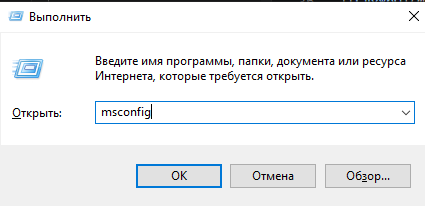
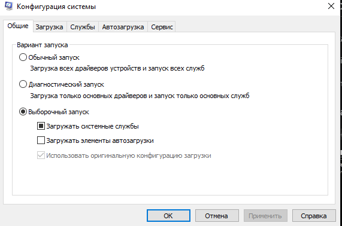
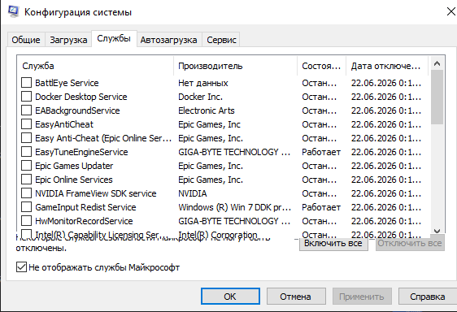
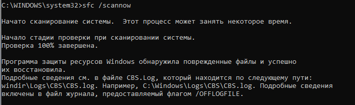
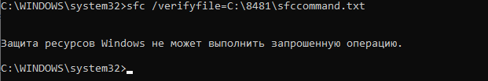

# Лабораторная работа №11
## Выполнение чистой загрузки ОС Windows 10. Проверка системных файлов Windows.

**Цель работы:** Научиться выполнять чистую загрузку Windows и проверять целостность системных файлов.

---

## Теоретические сведения

**Чистая загрузка (Clean Boot)** — запуск Windows с минимальным набором драйверов и служб, без стороннего ПО автозагрузки. Позволяет определить, конфликтует ли какая-то сторонняя программа или служба с системой.

**SFC (System File Checker)** — утилита командной строки для проверки и восстановления целостности системных файлов Windows. Позволяет исправить повреждения, вызванные сбоями или вредоносным ПО.

---

## Ход выполнения работы

### 1. Установка Windows 10

Установите Windows 10 на виртуальную машину (если необходимо).

Войдите в систему с использованием учетной записи, обладающей правами администратора.

### 2. Чистая загрузка

Нажмите `Win+R` для открытия меню «Выполнить», затем напишите `msconfig` и нажмите Enter.

На вкладке **Общие** выберите **Выборочный запуск** и снимите флажок **Загружать элементы автозагрузки**.

На вкладке **Службы** установите флажок **Не отображать службы Майкрософт** и нажмите **Отключить все**.

> **Примечание:** Это позволит системным службам Майкрософт продолжить загрузку. В их число входят сетевые службы, служба Plug and Play, служба протоколирования событий, служба регистрации ошибок и другие.

Нажмите **ОК**, затем нажмите **Перезагрузка**.

### 3. Проверка системных файлов

Запустите командную строку от имени администратора. Для этого в Windows найдите этот пункт в меню Пуск, кликните по нему правой кнопкой мыши и выберите соответствующий пункт меню.

В командной строке введите `sfc /scannow` и нажмите Enter.

**Результат проверки:**

**Вывод:** Программа SFC успешно проверила и восстановила поврежденные системные файлы.

### 4. Параметры команды sfc

Выясните параметры команды `sfc /help`:

**Основные параметры SFC:**

| Параметр | Описание |
|----------|----------|
| `/scannow` | Проверяет все защищенные системные файлы и пытается восстановить поврежденные |
| `/verifyonly` | Только проверяет целостность всех системных файлов, но не восстанавливает их |
| `/scanfile=<путь>` | Проверяет и восстанавливает конкретный системный файл |
| `/verifyfile=<путь>` | Только проверяет целостность конкретного системного файла |
| `/offbootdir=<каталог>` | Используется для проверки в автономном режиме |
| `/offwindir=<каталог>` | Используется для проверки в автономном режиме |

### 5. Практика с SFC

На диске C: создайте папку своей группы, используя только латинские буквы (пример: `8481`). В папке создайте текстовый документ с именем `sfccommand.txt`.

С помощью команды sfc проверьте целостность созданного вами файла:

**Результат:** SFC не может проверить созданный файл.

**Почему это произошло?** Утилита SFC предназначена для проверки защищенных системных файлов Windows. Она проверяет только файлы из системных каталогов (например, `C:\Windows\System32`). Созданный файл находится в пользовательской папке на диске C: и не является частью системы, поэтому SFC его игнорирует.

---

## Контрольные вопросы

### 1. Почему команда Sfc не может проверить созданный Вами файл sfccommand.txt?

`Утилита SFC (System File Checker) предназначена для проверки и восстановления защищенных системных файлов Windows. Она имеет базу данных контрольных сумм и сверяет с ней файлы только из определенных системных каталогов. Созданный вами файл находится в пользовательской папке на диске C: и не является частью системы, поэтому SFC его игнорирует.`

### 2. С какими параметрами можно использовать команду sfc?

`Основные параметры команды SFC: /scannow — проверяет все защищенные системные файлы и пытается восстановить поврежденные из кэша; /verifyonly — только проверяет целостность всех системных файлов, но не восстанавливает их; /scanfile=<путь> — проверяет и восстанавливает (если возможно) конкретный системный файл; /verifyfile=<путь> — только проверяет целостность конкретного системного файла; /offbootdir=<каталог> и /offwindir=<каталог> — используются для проверки системных файлов в автономном режиме, когда ОС не загружена.`

### 3. В каких ситуациях нужно использовать «чистую загрузку»?

`Чистую загрузку используют в сложных диагностических ситуациях для выявления программных конфликтов: 1) Когда Windows работает нестабильно, выдает "синий экран смерти" (BSOD) или зависает, и причина не очевидна; 2) Когда возникают ошибки при запуске или работе конкретных приложений, которые не удается устранить другими методами; 3) Когда нужно определить, какая из служб или программ в автозагрузке мешает нормальной работе системы, особенно при подозрении на вредоносное ПО.`