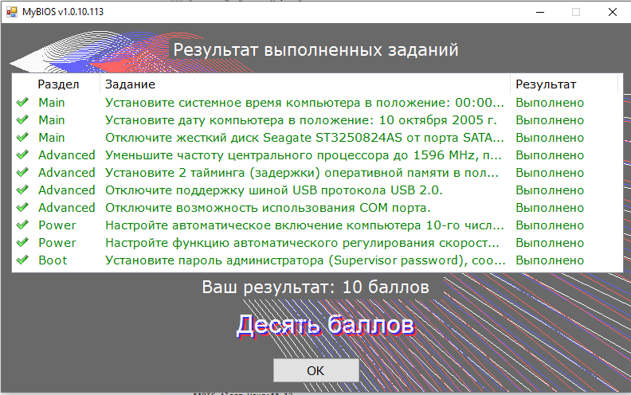

# Лабораторная работа: Настройка BIOS (American Megatrends)

**Цель работы:** Изучить структуру и основные разделы BIOS American Megatrends, научиться настраивать параметры BIOS Setup Utility в соответствии с заданием.

---

## Теоретические сведения

**BIOS** (Basic Input/Output System) — базовая система ввода-вывода. Представляет собой набор микропрограмм, записанных в микросхему EEPROM (ПЗУ) персонального компьютера, обеспечивающих начальную загрузку компьютера и последующий запуск операционной системы.

В данной работе используется BIOS American Megatrends (AMI) с интерфейсом AI Tweaker (разгон).

### Основные разделы BIOS AMI

| Раздел | Описание |
|--------|----------|
| **Main** | Настройка даты, времени, дисковых устройств, языка |
| **Advanced** | Настройка процессора, памяти, встроенных устройств, портов |
| **Power** | Настройка энергосбережения, автоматического включения |
| **Boot** | Настройка порядка загрузки, паролей |
| **Tools** | Вспомогательные утилиты |
| **Exit** | Сохранение изменений, выход без сохранения |

---

## Ход выполнения работы

### Задание 1. Раздел Main. Установка системного времени

**Задание:** Установите системное время компьютера в положение: 00:00:00 (HH:MM:SS).

**Выполнение:**

1. Войдите в BIOS Setup Utility (при загрузке нажмите `Del` или `F2`)
2. Перейдите в раздел **Main**
3. Выберите параметр **System Time**
4. Используйте клавиши `+` или `-` для изменения значения
5. Установите время: `00:00:00`
6. Нажмите `Enter` для подтверждения

**Результат:** Системное время установлено на 00:00:00.

---

### Задание 2. Раздел Main. Установка системной даты

**Задание:** Установите дату компьютера в положение: 10 октября 2005 г.

**Выполнение:**

1. В разделе **Main** выберите параметр **System Date**
2. Используйте клавиши `+` или `-` для изменения значения
3. Используйте `Tab` для переключения между полями (день/месяц/год)
4. Установите дату: `10/10/2005` (месяц/день/год) или `10/10/2005` (день/месяц/год) в зависимости от формата BIOS
5. Нажмите `Enter` для подтверждения

**Результат:** Системная дата установлена на 10 октября 2005 г.

---

### Задание 3. Раздел Main. Отключение жесткого диска

**Задание:** Отключите жесткий диск Seagate ST3250824AS от порта SATA.

**Выполнение:**

1. В разделе **Main** найдите параметр **SATA Configuration** или список подключенных устройств
2. Найдите устройство **Seagate ST3250824AS**
3. Выберите этот параметр и нажмите `Enter`
4. В появившемся списке выберите значение **Not Detected** или **Disabled**
5. Нажмите `Enter` для подтверждения

**Результат:** Жесткий диск Seagate ST3250824AS отключен от порта SATA.

---

### Задание 4. Раздел Advanced. Уменьшение частоты процессора

**Задание:** Уменьшите частоту центрального процессора до 1596 MHz, при этом частота системной шины должна остаться неизменной, т.е. равной 266 MHz.

**Выполнение:**

1. Перейдите в раздел **Advanced** или **AI Tweaker**
2. Найдите параметр **AI Overclock Tuner**
3. Измените значение с `[Auto]` на `[Manual]`
4. Найдите параметр **FSB Frequency** — убедитесь, что он равен `266 MHz` **(не изменяйте его!)**
5. Найдите параметр **CPU Ratio Setting** (множитель процессора)
   - Рассчитайте: `CPU Ratio = 1596 / 266 = 6`
6. Установите **CPU Ratio Setting** = `6`
7. Нажмите `Enter` для подтверждения

**Результат:** Частота процессора уменьшена до 1596 MHz при неизменной частоте системной шины 266 MHz.

---

### Задание 5. Раздел Advanced. Настройка таймингов оперативной памяти

**Задание:** Установите 2 тайминга (задержки) оперативной памяти в положение: RAS# to RAS# Delay = 5 DRAM Clocks, WRITE Recovery Time = 8 DRAM Clocks.

**Выполнение:**

1. В разделе **Advanced** найдите подраздел **DRAM Timing Control** или **Memory Configuration**
2. Нажмите `Enter` для входа в подраздел
3. Найдите параметр **RAS# to RAS# Delay** (или **tRRD**)
4. Установите значение: **5 DRAM Clocks**
5. Найдите параметр **WRITE Recovery Time** (или **tWR**)
6. Установите значение: **8 DRAM Clocks**
7. Нажмите `Enter` для подтверждения

**Результат:** Тайминги оперативной памяти настроены согласно заданию.

---

### Задание 6. Раздел Advanced. Отключение USB 2.0

**Задание:** Отключите поддержку шиной USB протокола USB 2.0.

**Выполнение:**

1. В разделе **Advanced** найдите подраздел **USB Configuration**
2. Найдите параметр **USB 2.0 Controller** или **USB 2.0 Support**
3. Установите значение: **Disabled**
4. Нажмите `Enter` для подтверждения

**Результат:** Поддержка USB 2.0 отключена.

---

### Задание 7. Раздел Advanced. Отключение COM-порта

**Задание:** Отключите возможность использования COM-порта.

**Выполнение:**

1. В разделе **Advanced** найдите подраздел **Onboard Devices Configuration** или **Integrated Peripherals**
2. Найдите параметр **Serial Port 1** или **COM Port**
3. Установите значение: **Disabled**
4. Нажмите `Enter` для подтверждения

**Результат:** COM-порт отключен.

---

### Задание 8. Раздел Power. Настройка автоматического включения

**Задание:** Настройте автоматическое включение компьютера 10-го числа каждого месяца в 12 часов.

**Выполнение:**

1. Перейдите в раздел **Power**
2. Найдите параметр **Power On By RTC Alarm** или **Resume By Alarm**
3. Установите значение: **Enabled**
4. Настройте параметры:
   - **RTC Alarm Date (Days):** 10
   - **RTC Alarm Hour:** 12
   - **RTC Alarm Minute:** 00
   - **RTC Alarm Second:** 00

**Результат:** Компьютер настроен на автоматическое включение 10-го числа каждого месяца в 12:00.

---

### Задание 9. Раздел Power. Настройка скорости вентилятора

**Задание:** Настройте функцию автоматического регулирования скорости вращения процессора в самое тихое положение.

**Выполнение:**

1. В разделе **Power** найдите подраздел **Hardware Monitor** или **Monitor**
2. Найдите параметр **CPU Smart Fan Control** или **CPU Q-Fan Control**
3. Установите значение: **Enabled**
4. Найдите параметр **CPU Fan Profile** или **Fan Speed Mode**
5. Установите значение: **Silent** или **Quiet**

**Результат:** Вентилятор процессора работает в самом тихом режиме.

---

### Задание 10. Раздел Boot. Установка пароля администратора

**Задание:** Установите пароль администратора (Supervisor password), соответствующий комбинации из 3 цифр: 123.

**Выполнение:**

1. Перейдите в раздел **Boot** (или **Security**)
2. Найдите параметр **Supervisor Password** или **Set Supervisor Password**
3. Нажмите `Enter`
4. Введите пароль: `123`
5. Подтвердите пароль: `123`
6. Нажмите `Enter` для сохранения

**Результат:** Пароль администратора установлен: 123.

---

### Задание 11. Раздел Exit. Сохранение настроек и выход

После выполнения всех настроек:

1. Перейдите в раздел **Exit**
2. Выберите **Save Changes and Reset** (или **Save Changes and Exit**)
3. Нажмите `Enter`
4. Подтвердите сохранение изменений
5. Компьютер перезагрузится с новыми настройками

**Результат:** Все настройки BIOS сохранены, компьютер перезагружен.

---

## Сводная таблица выполненных настроек

| Раздел | Задание | Результат |
|--------|---------|-----------|
| Main | Системное время: 00:00:00 | ✅ Выполнено |
| Main | Системная дата: 10.10.2005 | ✅ Выполнено |
| Main | Отключение HDD Seagate ST3250824AS | ✅ Выполнено |
| Advanced | Частота CPU: 1596 MHz (FSB = 266 MHz) | ✅ Выполнено |
| Advanced | RAS# to RAS# Delay = 5 DRAM Clocks | ✅ Выполнено |
| Advanced | WRITE Recovery Time = 8 DRAM Clocks | ✅ Выполнено |
| Advanced | Отключение USB 2.0 | ✅ Выполнено |
| Advanced | Отключение COM-порта | ✅ Выполнено |
| Power | Автовключение 10-го числа в 12:00 | ✅ Выполнено |
| Power | Тихий режим вентилятора | ✅ Выполнено |
| Boot | Пароль администратора: 123 | ✅ Выполнено |

---

## Результат выполнения работы

**Результат:** 10 баллов

Все задания выполнены успешно. Конфигурация BIOS настроена в соответствии с требованиями.

---

## Контрольные вопросы

### 1. Для чего нужна процедура POST?

`POST (Power-On Self-Test) — это процедура самотестирования, которая запускается сразу после включения ПК. Она проверяет процессор, оперативную память, видеокарту и другие ключевые компоненты. Ошибки POST могут сигнализироваться звуковыми сигналами.`

### 2. Как попасть в настройки BIOS?

`Для входа в BIOS при загрузке компьютера нажимается определенная клавиша или комбинация клавиш. Наиболее распространённые клавиши — Del и F2. Точная клавиша зависит от производителя материнской платы.`

### 3. Какие риски существуют при обновлении BIOS и как их минимизировать?

`Основные риски: 1) Прерывание питания во время перепрошивки; 2) Установка неправильной версии BIOS. Способы минимизации: создание резервной копии старой версии BIOS, подключение ноутбука к сети во время обновления, внимательное изучение изменений перед обновлением.`