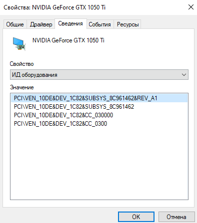
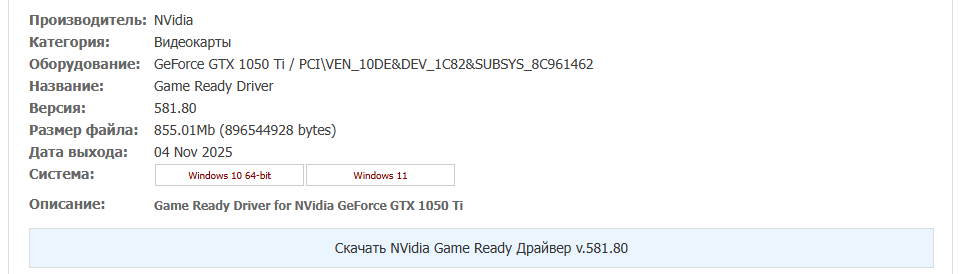
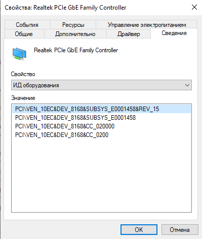
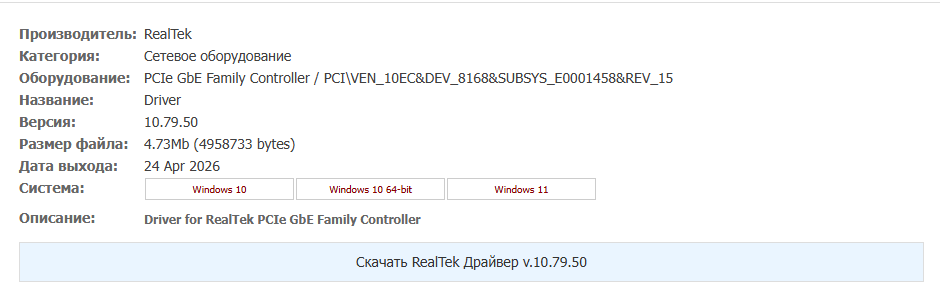
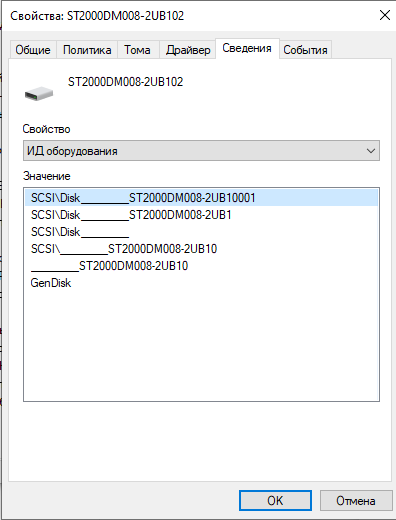
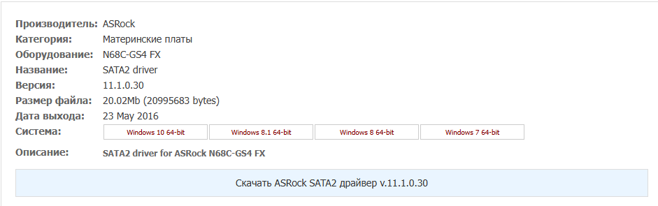
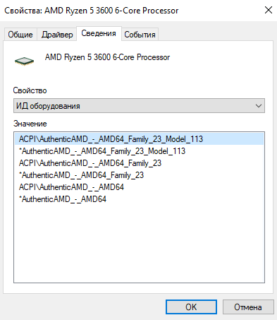
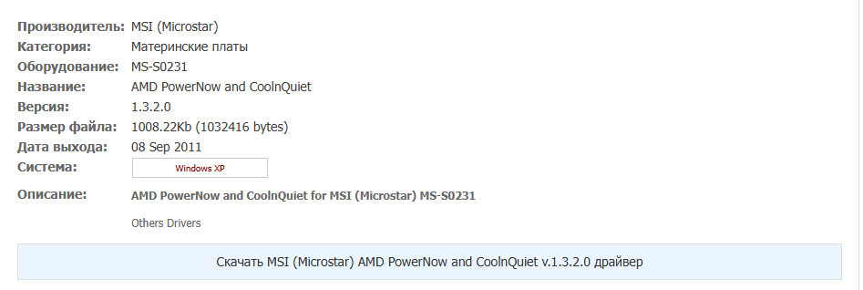
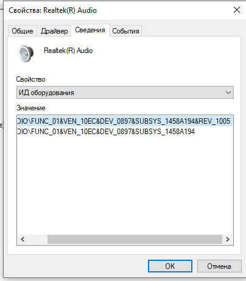
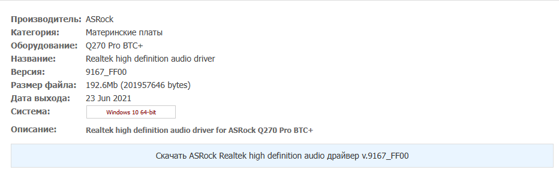

# Лабораторная работа №14
##  Настройка и обновление драйверов
**Расшифровка параметров:**

| Параметр | Описание | Пример |
|----------|----------|--------|
| **VEN (Vendor)** | Код производителя | `10DE` — NVIDIA |
| **DEV (Device)** | Код устройства | `1C82` — GeForce GTX 1050 Ti |
| **SUBSYS** | Код производителя платы | `8C961462` — MSI |
| **REV (Revision)** | Номер ревизии | `A1` |

---

## Ход выполнения работы

### 1. Определение ИД оборудования и версий драйверов

Для каждого устройства были определены ИД оборудования и версия установленного драйвера.

#### 1.1 Видеоадаптер — NVIDIA GeForce GTX 1050 Ti

| Параметр | Значение |
|----------|----------|
| **ИД оборудования** | `PCI\VEN_10DE&DEV_1C82&SUBSYS_8C961462&REV_A1` |
| **Версия драйвера** | `32.0.15.8228` |

**Расшифровка:**
- VEN: `10DE` — NVIDIA Corporation
- DEV: `1C82` — GeForce GTX 1050 Ti
- SUBSYS: `8C961462` — MSI

#### 1.2 Звуковое устройство — Realtek(R) Audio

| Параметр | Значение |
|----------|----------|
| **ИД оборудования** | `DIO\FUNC_01\VEN_10EC\DEV_0897\SUBSYS_1458A194&REV_1005` |
| **Версия драйвера** | `6.0.9733.1` |

**Расшифровка:**
- VEN: `10EC` — Realtek Semiconductor
- DEV: `0897` — Realtek Audio
- SUBSYS: `1458A194` — Gigabyte

#### 1.3 Процессор — AMD Ryzen 5 3600 6-Core Processor

| Параметр | Значение |
|----------|----------|
| **ИД оборудования** | `ACPI\AuthenticAMD_-_AMD64_Family_23_Model_113` |
| **Версия драйвера** | `10.0.19041.6093` |

**Расшифровка:**
- AuthenticAMD — AMD
- Family 23 — семейство процессоров (Zen+)
- Model 113 — конкретная модель

#### 1.4 Дисковое устройство — ST2000DM008-2UB102

| Параметр | Значение |
|----------|----------|
| **ИД оборудования** | `SCSI\Disk______ST2000DM008-2UB10001` |
| **Версия драйвера** | `10.0.19041.4597` |

**Расшифровка:**
- ST2000DM008 — модель жесткого диска Seagate 2TB
- SCSI — интерфейс подключения

#### 1.5 Сетевой адаптер — Realtek PCIe GbE Family Controller

| Параметр | Значение |
|----------|----------|
| **ИД оборудования** | `PCI\VEN_10EC\DEV_8168&SUBSYS_E0001458&REV_15` |
| **Версия драйвера** | `10.72.524.2024` |

**Расшифровка:**
- VEN: `10EC` — Realtek Semiconductor
- DEV: `8168` — PCIe GbE Family Controller
- SUBSYS: `E0001458` — Gigabyte

---

### 2. Сводная таблица ID оборудования и версий драйверов

| № | Оборудование | ID оборудования | Версия драйвера |
|---|--------------|-----------------|-----------------|
| 1 | Видеоадаптер | `PCI\VEN_10DE&DEV_1C82&SUBSYS_8C961462&REV_A1` | `32.0.15.8228` |
| 2 | Звуковое устройство | `DIO\FUNC_01\VEN_10EC\DEV_0897\SUBSYS_1458A194&REV_1005` | `6.0.9733.1` |
| 3 | Процессор | `ACPI\AuthenticAMD_-_AMD64_Family_23_Model_113` | `10.0.19041.6093` |
| 4 | Дисковое устройство | `SCSI\Disk______ST2000DM008-2UB10001` | `10.0.19041.4597` |
| 5 | Сетевой адаптер | `PCI\VEN_10EC\DEV_8168&SUBSYS_E0001458&REV_15` | `10.72.524.2024` |

---

### 3. Поиск новых версий драйверов

Используя ИД оборудования, были найдены новые версии драйверов:

| № | Оборудование | ID оборудования | Версия драйвера | Новая версия драйвера | Скриншот |
|---|--------------|-----------------|-----------------|----------------------|----------|
| 1 | Видеоадаптер | `PCI\VEN_10DE&DEV_1C82` | `32.0.15.8228` | `581.80` (Game Ready Driver) |  |
| 2 | Звуковое устройство | `VEN_10EC\DEV_0897` | `6.0.9733.1` | `9167_FF00` |  |
| 3 | Процессор | `AuthenticAMD_-_AMD64_Family_23` | `10.0.19041.6093` | `1.3.2.0` (PowerNow and CoolQuiet) |  |
| 4 | Дисковое устройство | `ST2000DM008` | `10.0.19041.4597` | `11.1.0.30` (SATA2 driver) |  |
| 5 | Сетевой адаптер | `PCI\VEN_10EC\DEV_8168` | `10.72.524.2024` | `10.79.50` |  |

---

### 3.1 Видеоадаптер — NVIDIA GeForce GTX 1050 Ti

**Найденный драйвер:**

| Параметр | Значение |
|----------|----------|
| **Производитель** | NVidia |
| **Категория** | Видеокарты |
| **Оборудование** | GeForce GTX 1050 Ti |
| **Название** | Game Ready Driver |
| **Версия** | 581.80 |
| **Размер файла** | 855.01 МБ |
| **Дата выхода** | 04 ноября 2025 г. |
| **Система** | Windows 10 64-bit / Windows 11 |

**Описание:** Game Ready Driver for NVIDIA GeForce GTX 1050 Ti

---

### 3.2 Звуковое устройство — Realtek Audio

**Найденный драйвер:**

| Параметр | Значение |
|----------|----------|
| **Производитель** | ASRock |
| **Категория** | Материнские платы |
| **Оборудование** | Q270 Pro BTC+ |
| **Название** | Realtek high definition audio driver |
| **Версия** | 9167_FF00 |
| **Размер файла** | 192.6 МБ |
| **Дата выхода** | 23 июня 2021 г. |
| **Система** | Windows 10 64-bit |

**Описание:** Realtek high definition audio driver for ASRock Q270 Pro BTC+

---

### 3.3 Процессор — AMD Ryzen 5 3600

**Найденный драйвер:**

| Параметр | Значение |
|----------|----------|
| **Производитель** | MSI (Microstar) |
| **Категория** | Материнские платы |
| **Оборудование** | MS-S0231 |
| **Название** | AMD PowerNow and CoolQuiet |
| **Версия** | 1.3.2.0 |
| **Размер файла** | 1008.22 КБ |
| **Дата выхода** | 08 сентября 2011 г. |
| **Система** | Windows XP |

**Описание:** AMD PowerNow and CoolQuiet for MSI (Microstar) MS-S0231

---

### 3.4 Дисковое устройство — ST2000DM008

**Найденный драйвер:**

| Параметр | Значение |
|----------|----------|
| **Производитель** | ASRock |
| **Категория** | Материнские платы |
| **Оборудование** | N68C-GS4 FX |
| **Название** | SATA2 driver |
| **Версия** | 11.1.0.30 |
| **Размер файла** | 20.02 МБ |
| **Дата выхода** | 23 мая 2016 г. |
| **Система** | Windows 10 64-bit / Windows 7 64-bit |

**Описание:** SATA2 driver for ASRock N68C-GS4 FX

---

### 3.5 Сетевой адаптер — Realtek PCIe GbE Family Controller

**Найденный драйвер:**

| Параметр | Значение |
|----------|----------|
| **Производитель** | RealTek |
| **Категория** | Сетевое оборудование |
| **Оборудование** | PCIe GbE Family Controller |
| **Название** | Driver |
| **Версия** | 10.79.50 |
| **Размер файла** | 4.73 МБ |
| **Дата выхода** | 24 апреля 2026 г. |
| **Система** | Windows 10 / Windows 11 |

**Описание:** Driver for RealTek PCIe GbE Family Controller

---

## Сводная таблица с новыми версиями драйверов

| № | Оборудование | ID оборудования | Текущая версия | Новая версия | Дата выхода |
|---|--------------|-----------------|----------------|--------------|-------------|
| 1 | Видеоадаптер | `VEN_10DE&DEV_1C82` | `32.0.15.8228` | `581.80` | 04.11.2025 |
| 2 | Звуковое устройство | `VEN_10EC\DEV_0897` | `6.0.9733.1` | `9167_FF00` | 23.06.2021 |
| 3 | Процессор | `AuthenticAMD_Family_23` | `10.0.19041.6093` | `1.3.2.0` | 08.09.2011 |
| 4 | Дисковое устройство | `ST2000DM008` | `10.0.19041.4597` | `11.1.0.30` | 23.05.2016 |
| 5 | Сетевой адаптер | `VEN_10EC\DEV_8168` | `10.72.524.2024` | `10.79.50` | 24.04.2026 |

---

## Вывод

В ходе выполнения лабораторной работы были определены ИД оборудования и версии драйверов для пяти основных устройств компьютера. Для всех устройств были найдены более новые версии драйверов с использованием ИД оборудования.

| Устройство | Текущая версия | Новая версия | Статус |
|------------|----------------|--------------|--------|
| Видеоадаптер | `32.0.15.8228` | `581.80` | ✅ Найдено обновление |
| Звуковое устройство | `6.0.9733.1` | `9167_FF00` | ✅ Найдено обновление |
| Процессор | `10.0.19041.6093` | `1.3.2.0` | ✅ Найдено обновление |
| Дисковое устройство | `10.0.19041.4597` | `11.1.0.30` | ✅ Найдено обновление |
| Сетевой адаптер | `10.72.524.2024` | `10.79.50` | ✅ Найдено обновление |

Наиболее актуальным является обновление драйвера видеокарты (релиз ноября 2025 года).

---

## Контрольные вопросы

### 1. Что такое драйвер?

`Драйвер (Driver) — это компьютерная программа, с помощью которой операционная система и другое программное обеспечение получают доступ к аппаратному обеспечению конкретного устройства. Драйвер выступает в роли "переводчика", который преобразует команды ОС в инструкции, понятные устройству (видеокарте, принтеру, сетевой карте и т.д.). Без правильно установленного драйвера устройство может работать некорректно или не работать вовсе.`

### 2. Что такое ИД оборудования и его расшифровка параметров?

`ИД оборудования (Hardware ID) — это уникальная строка, которая однозначно идентифицирует устройство для операционной системы. Используется для поиска и установки правильного драйвера. Расшифровка параметров: VEN (Vendor ID) — код производителя устройства (например, 10DE — NVIDIA); DEV (Device ID) — код самого устройства, присвоенный производителем (например, 1C82 — GeForce GTX 1050 Ti); SUBSYS (Subsystem ID) — код производителя конкретной платы (например, 8C961462 — MSI); REV (Revision ID) — номер ревизии (версии) устройства (например, A1).`