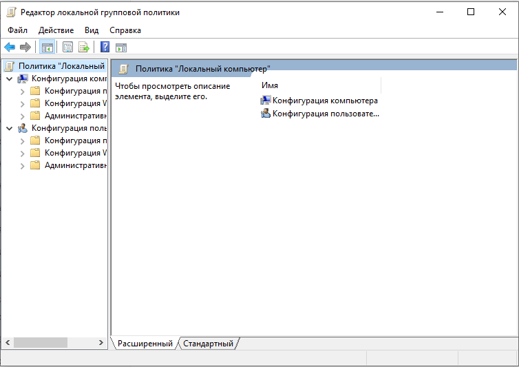
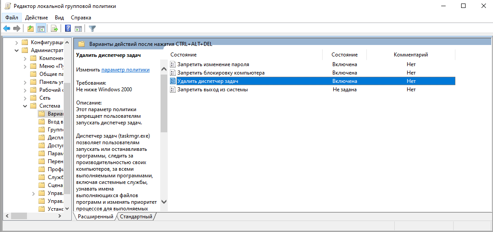
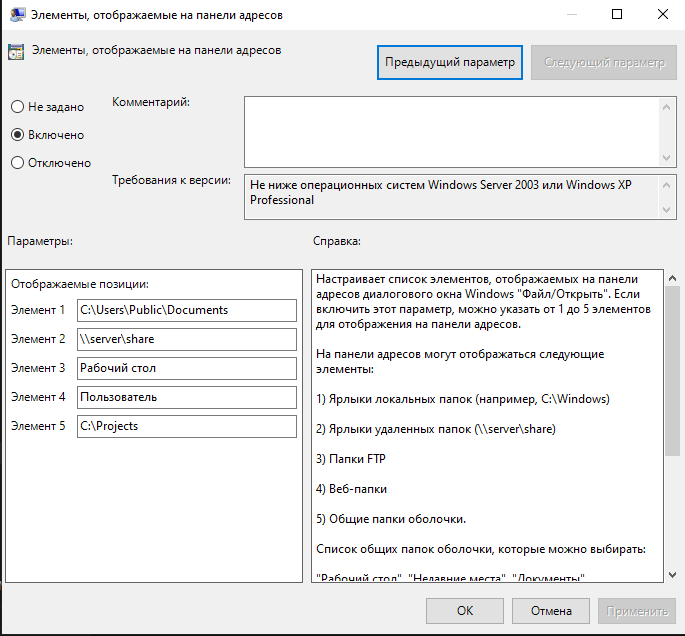

# Практическая работа №16
## Групповые политики Windows 10

**Цель работы:** Изучить принципы управления настройками операционной системы с помощью редактора локальной групповой политики.

---

## Теоретические сведения

**Редактор локальной групповой политики** (`gpedit.msc`) — оснастка, позволяющая централизованно управлять огромным количеством системных параметров. Политики делятся на две категории:

| Раздел | Описание |
|--------|----------|
| **Конфигурация компьютера** | Применяются ко всем пользователям до входа в систему |
| **Конфигурация пользователя** | Применяются к текущему пользователю после входа |

---

## Ход выполнения работы

### 1. Запуск редактора локальной групповой политики

Нажмите `Win+R`, введите `gpedit.msc` и нажмите `Enter`.

---

### 2. Настройка окна безопасности Windows

**Путь:** Конфигурация пользователя → Административные шаблоны → Система → Варианты действий после нажатия CTRL+ALT+DEL

Включите следующие политики для скрытия кнопок в окне безопасности Windows:

| Политика | Состояние |
|----------|-----------|
| Запретить изменение пароля | Включена |
| Запретить блокировку компьютера | Включена |
| Удалить диспетчер задач | Включена |
| Запретить выход из системы | Не задана |

---

### 3. Настройка панели мест

**Задание:** Настройте элементы, отображаемые на панели адресов в диалоговых окнах «Открыть» и «Сохранить как».

**Путь:** Конфигурация пользователя → Административные шаблоны → Компоненты Windows → Проводник Windows → Общее диалоговое окно открытия файлов

**Параметр:** Элементы, отображаемые на панели адресов

**Настройка:**

| Параметр | Значение |
|----------|----------|
| Состояние | Включено |
| Элемент 1 | `C:\Users\Public\Documents` |
| Элемент 2 | `\\server\share` |
| Элемент 3 | `Рабочий стол` |
| Элемент 4 | `Пользователь` |
| Элемент 5 | `C:\Projects` |

---

### 4. Настройка размера списка недавних документов

**Задание:** Увеличьте размер списка недавних документов до 20 элементов.

**Путь:** Конфигурация пользователя → Административные шаблоны → Компоненты Windows → Проводник Windows

**Параметр:** Максимальная длина списка "Недавние документы"

**Настройка:**

| Параметр | Значение |
|----------|----------|
| Состояние | Включено |
| Максимальная длина списка "Недавние документы" | 20 |

---

### 5. Включение диалога слежения за завершением работы

**Задание:** Включите диалог слежения за завершением работы.

**Путь:** Конфигурация компьютера → Административные шаблоны → Система

**Параметр:** Отображать диалог слежения за завершением работы

**Настройка:**

| Параметр | Значение |
|----------|----------|
| Состояние | Включено |
| Диалог слежения за завершением работы должен отображаться | Всегда |

---

### 6. Дополнительное задание

**Задание:** Самостоятельно найдите и включите политику **"Скрыть панель адресов из общих диалогов открытия файлов"**.

**Путь:** Конфигурация пользователя → Административные шаблоны → Компоненты Windows → Проводник Windows → Общее диалоговое окно открытия файлов

**Параметр:** Скрыть панель адресов из общих диалогов открытия файлов

**Настройка:**

| Параметр | Значение |
|----------|----------|
| Состояние | Включено |

---

## Сводная таблица выполненных настроек

| № | Политика | Путь | Состояние |
|---|----------|------|-----------|
| 1 | Запретить изменение пароля | Конфигурация пользователя → Система → Варианты действий после CTRL+ALT+DEL | Включена |
| 2 | Запретить блокировку компьютера | Конфигурация пользователя → Система → Варианты действий после CTRL+ALT+DEL | Включена |
| 3 | Удалить диспетчер задач | Конфигурация пользователя → Система → Варианты действий после CTRL+ALT+DEL | Включена |
| 4 | Элементы, отображаемые на панели адресов | Конфигурация пользователя → Проводник Windows → Общее диалоговое окно открытия файлов | Включена |
| 5 | Максимальная длина списка "Недавние документы" | Конфигурация пользователя → Проводник Windows | Включена |
| 6 | Отображать диалог слежения за завершением работы | Конфигурация компьютера → Система | Включена |
| 7 | Скрыть панель адресов из общих диалогов открытия файлов | Конфигурация пользователя → Проводник Windows → Общее диалоговое окно открытия файлов | Включена |

---

## Контрольные вопросы

### 1. Что такое групповые политики?

`Групповые политики (Group Policy) — это механизм администрирования, позволяющий централизованно управлять конфигурацией операционной системы, приложений и пользовательских параметров на множестве компьютеров. Они используются в доменных сетях, а также на локальном уровне для тонкой настройки системы.`

### 2. Категории объектов групповых политик.

`Выделяют два основных типа объектов групповых политик: 1) Локальная групповая политика (Local Group Policy) — применяется только к конкретному компьютеру и действует локально; 2) Доменная групповая политика (Domain Group Policy) — создается на сервере домена (Active Directory) и применяется к группам компьютеров и пользователей, объединенных в организационные подразделения (OU).`

### 3. Разделы групповых политик.

`В редакторе локальной групповой политики (gpedit.msc) есть два основных раздела: 1) Конфигурация компьютера — содержит политики, которые применяются ко всем пользователям компьютера до входа в систему. Влияют на системные параметры (безопасность, сеть, службы); 2) Конфигурация пользователя — содержит политики, которые применяются к конкретному пользователю после входа в систему. Влияют на внешний вид и настройки рабочей среды (меню "Пуск", панель задач, настройки Проводника).`

### 4. Запуск групповых политик.

`Для запуска редактора локальной групповой политики нужно: 1) Нажать сочетание клавиш Win + R; 2) В появившемся окне «Выполнить» ввести команду gpedit.msc; 3) Нажать Enter.`