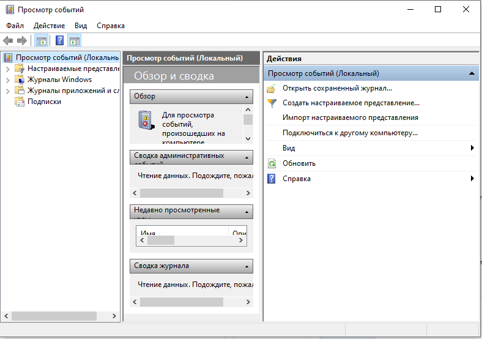

# Лабораторная работа №19
## Работа с журналами событий Windows

**Цель работы:** Изучить принцип работы журналов событий ОС Windows.

---

## Теоретические сведения

**Журнал событий** — это база данных, в которую Windows записывает информацию о важных событиях для диагностики и мониторинга безопасности.

**Физическое расположение:** `%SystemRoot%/System32/Winevt/Logs`

**Категории журналов:**

| Категория | Описание |
|-----------|----------|
| **Система** | События от системных компонентов, драйверов и модулей Windows |
| **Приложения** | Записи, созданные различными программами |
| **Безопасность** | Сведения, связанные с безопасностью системы |
| **Установка** | События установки и обновления ПО |

---

## Ход выполнения работы

### 1. Запуск утилиты журнала событий

Выполните в окне Run (Win+R) команду `eventvwr.msc`.

Откроется окно **Просмотр событий**.

### 2. Установка фильтра для журнала «Система»

Выберите **Журналы Windows → Система**, справа нажмите **«Фильтр текущего журнала»**.

Установите фильтр:
- **Дата:** Любое время (или выберите нужный период)
- **Уровень события:** Критическое, Ошибка, Предупреждение
- **По журналу:** Система

**Результат:** Отфильтровано: Журнал: System; Уровни: Критический, Ошибка, Предупреждение.

### 3. Сохранение фильтра

Справа нажмите **«Сохранить фильтр в настраиваемое представление...»**.

Настройте сохранение, укажите имя и нажмите «ОК».

Сохраненный фильтр появится в панели слева в разделе **Настраиваемые представления**.

### 4. Создание фильтра для журнала «Безопасность»

Создайте фильтр для журнала «Безопасность»:
- **Дата:** Последние 30 дней
- **Уровень события:** Предупреждения, Сведения

Сохраните фильтр с именем группы (например, `2ИСП9-1 Безопасность`).

### 5. Привязка задачи к событию

Выделите событие → в правой панели выберите **«Привязать задачу к событию...»**.

Настройте задачу:
- **Имя:** Событие № 2
- **Размещение:** \Задачи просмотра событий

На вкладке **«Параметры»** установите:
- [x] Выполнять задачу по требованию
- [ ] Немедленно запускать задачу, если пропущен плановый запуск
- [x] При сбое выполнения перезапускать через: 10 мин.
- [x] Количество попыток перезапуска: 5
- [x] Останавливать задачу, выполняемую дольше
- [x] Принудительная остановка задачи, если она не прекращается по запросу
- [ ] Если повтор задачи не запланирован, удалять через: 30 дн.
- Если задача уже выполняется, то применять правило: **Не запускать новый экземпляр**

### 6. Очистка журнала «Установка»

Очистите журнал «Установка» (ПКМ → «Очистить журнал»).

При запросе выберите **«Сохранить и очистить»** или **«Очистить»**.

### 7. Настройка службы «Журнал событий Windows»

Откройте оснастку `services.msc`, найдите службу **«Журнал событий Windows»**.

**Вкладка «Общие»:**
- **Тип запуска:** Вручную

**Вкладка «Восстановление»:**

| Параметр | Значение |
|----------|----------|
| Первый сбой | Не выполнять никаких действий |
| Второй сбой | Не выполнять никаких действий |
| Последующие сбои | Перезагрузка компьютера |
| Сброс счетчика ошибок через | 10 дн. |
| Перезапуск службы через | 1 мин. |

---

## Сводная таблица выполненных действий

| № | Действие | Результат |
|---|----------|-----------|
| 1 | Запуск eventvwr.msc | Открыто окно «Просмотр событий» |
| 2 | Фильтр для журнала «Система» | Отфильтрованы события по уровням |
| 3 | Сохранение фильтра | Фильтр сохранен в «Настраиваемые представления» |
| 4 | Фильтр для журнала «Безопасность» | Создан фильтр с именем группы |
| 5 | Привязка задачи к событию | Создана задача «Событие № 2» |
| 6 | Очистка журнала «Установка» | Журнал очищен |
| 7 | Настройка службы EventLog | Тип запуска: Вручную, Восстановление: Перезагрузка |

---

## Контрольные вопросы

### 1. Что такое журналы события Windows?

`Журналы событий Windows — это системные базы данных, в которые операционная система и приложения записывают информацию о важных событиях: ошибках, предупреждениях, информационных сообщениях и аудите безопасности. Они являются основным инструментом для диагностики проблем, мониторинга работоспособности и расследования инцидентов безопасности.`

### 2. Физическое расположение журнала Windows.

`Файлы журналов событий в формате .evtx физически хранятся в системной папке: %SystemRoot%\System32\winevt\Logs (например, C:\Windows\System32\winevt\Logs\System.evtx).`

### 3. Основные и дополнительные категории журнала Windows.

`Основные категории: "Система" (события от системных компонентов и драйверов), "Приложения" (события от установленных программ) и "Безопасность" (события, связанные с безопасностью). Дополнительные категории: "Установка" (события установки и обновления ПО) и "Перенаправленные события" (события с удаленных компьютеров).`