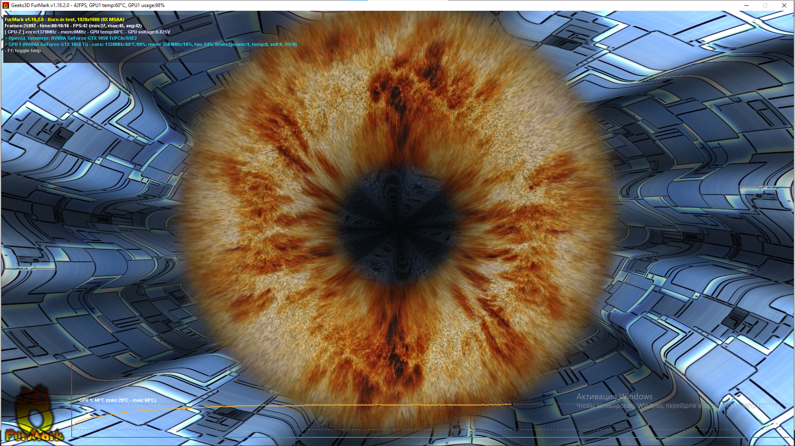

# Лабораторная работа №6
## Определение основных характеристик и тестирование видеосистемы ПК

**Цель работы:** Изучить современные видеокарты на графических процессорах NVIDIA, AMD (ATI) и технологии объединения видеокарт.

**Оборудование:** Учебный персональный компьютер с видеокартой NVIDIA GeForce GTX 1050 Ti.

**Программное обеспечение:** GPU-Z v2.6.0, FurMark v1.18.2.0, FluidMark v1.6.2.

---

## Ход выполнения работы

### 1. Определение параметров видеокарты в GPU-Z

Используя программу GPU-Z, были определены следующие параметры тестируемой видеокарты:

| Параметр | Значение |
|----------|----------|
| **Имя графического адаптера** | NVIDIA GeForce GTX 1050 Ti |
| **GPU (графический процессор)** | GP107 |
| **Ревизия** | A1 |
| **Технология выполнения** | 14 нм |
| **Размер кристалла** | 132 мм² |
| **Дата выпуска** | 25 октября 2016 г. |
| **Количество транзисторов** | 3300 млн |
| **Версия BIOS** | 86.07.22.00.57 |
| **Поддержка UEFI** | Да |
| **Производитель (Subvendor)** | MSI |
| **Идентификатор устройства** | 10DE 1C82 - 1462 8C96 |
| **Количество ROPs / TMUs** | 32 / 48 |
| **Интерфейс шины** | PCIe x16 3.0 @ x16 3.0 |
| **Количество шейдеров** | 768 Unified |
| **Поддержка DirectX** | 12 (12_1) |
| **Скорость заполнения пикселей** | 42.9 GPixel/с |
| **Скорость заполнения текстур** | 64.4 GTexel/с |
| **Тип памяти** | GDDR5 (Samsung) |
| **Шина памяти** | 128 бит |
| **Объем памяти** | 4096 МБ |
| **Пропускная способность памяти** | 112.1 ГБ/с |
| **Версия драйвера** | 32.0.15.8228 (NVIDIA 582.28) |
| **Дата драйвера** | 20 января 2026 г. |
| **Цифровая подпись** | WHQL |
| **Базовая частота GPU** | 1342 МГц |
| **Частота памяти** | 1752 МГц |
| **Частота Boost** | 1455 МГц |

---

### 2. Мониторинг датчиков в GPU-Z

В разделе **Sensors** были получены следующие показатели в состоянии простоя (Idle):

| Параметр | Значение |
|----------|----------|
| **GPU Core Clock** | 607.5 МГц / 202.5 МГц |
| **GPU Temperature (Idle)** | 29.0 °C |
| **Fan Speed** | 45% |
| **Memory Used** | 704 МБ |
| **GPU Load** | 30% |
| **Memory Controller Load** | 33% |
| **Video Engine Load** | 0% |
| **Bus Interface Load** | 0% |
| **PerfCap Reason** | Idle |
| **VDDC (напряжение)** | 0.6750 В |

---

### 3. Информация о лимитах питания и температуры

| Параметр | Текущее | Минимум | Максимум |
|----------|---------|---------|----------|
| **Power Limit** | 100.0% | 70.0% | 100.0% |
| **Temperature Limit** | 83.0 °C | 65.0 °C | 97.0 °C |

---

### 4. Тестирование в FurMark

#### Параметры теста:
- **Разрешение:** 1920 x 1080
- **Режим:** Burn-in test
- **Сглаживание:** 0X MSAA
- **Рендеринг:** OpenGL
- **Длительность:** 10 минут 16 секунд

#### Результаты теста:

| Параметр | Значение |
|----------|----------|
| **Минимальный FPS** | 37 |
| **Средний FPS** | 42 |
| **Максимальный FPS** | 45 |
| **Время теста** | 00:10:16 |

#### Показатели во время теста (под нагрузкой):

| Параметр | Значение |
|----------|----------|
| **Частота ядра GPU** | 1328 МГц |
| **Частота памяти** | 3504 МГц |
| **Температура GPU** | 60 °C |
| **Напряжение GPU** | 0.825 В |
| **Загрузка GPU** | 99% |
| **Скорость вентилятора** | 50% |

#### Динамика температуры:

| Состояние | Температура |
|-----------|-------------|
| **Минимальная (Idle)** | 29 °C |
| **Максимальная (под нагрузкой)** | 60 °C |
| **Прирост температуры** | +31 °C |

---

### 5. Тестирование в FluidMark

#### Параметры теста:
- **Режим:** Stability test
- **Длительность:** 5 минут 18 секунд
- **Технология:** PhysX CPU
- **Сглаживание:** 0.9 MSAA
- **Количество частиц:** 119 756

#### Результаты теста:

| Параметр | Значение |
|----------|----------|
| **Минимальный FPS** | 4 |
| **Средний FPS** | 5 |
| **Максимальный FPS** | 81 |
| **Всего кадров** | 1437 |
| **Количество симуляций** | 744 |
| **Время теста** | 00:05:18 |

#### Показатели во время теста:

| Параметр | Значение |
|----------|----------|
| **Частота ядра GPU** | 1480 МГц |
| **Частота памяти** | 3504 МГц |
| **Температура GPU** | 31-32 °C |
| **Напряжение GPU** | 0.862 В |
| **Загрузка GPU** | 5% |

---

### 6. Сравнение результатов тестов

| Параметр | FurMark | FluidMark |
|----------|---------|-----------|
| **Средний FPS** | 42 | 5 |
| **Температура GPU** | 60 °C | 32 °C |
| **Загрузка GPU** | 99% | 5% |
| **Напряжение GPU** | 0.825 В | 0.862 В |
| **Частота GPU** | 1328 МГц | 1480 МГц |

**Объяснение различий:**
- **FurMark** создает экстремальную нагрузку на GPU (99%), что объясняет высокую температуру и низкую частоту (thermal throttling)
- **FluidMark** использует PhysX и нагружает преимущественно CPU, поэтому GPU загружен только на 5%
- Более высокая частота GPU в FluidMark (1480 МГц) связана с меньшей тепловой нагрузкой

---

### 7. Вывод о качестве установленного видеоадаптера

**Результаты тестирования:**

| Критерий | Оценка | Комментарий |
|----------|--------|-------------|
| **Стабильность** | Отлично | Видеокарта стабильно работает под 99% нагрузкой в течение 10+ минут |
| **Температурный режим** | Отлично | Максимум 60 °C под нагрузкой (лимит 83 °C, запас 23 °C) |
| **Эффективность охлаждения** | Хорошо | Вентилятор на 50%, температура +31 °C от простоя |
| **Производительность (FurMark)** | Хорошо | 42 FPS в разрешении 1080p |
| **Производительность (FluidMark)** | Средняя | 5 FPS, но это зависит от CPU (используется PhysX) |
| **Энергопотребление** | В норме | Напряжение 0.825 В под нагрузкой |

**Заключение:** Видеокарта **NVIDIA GeForce GTX 1050 Ti** полностью работоспособна и стабильна. Система охлаждения эффективно справляется с нагрузкой, обеспечивая хороший запас по температурам. Видеокарта подходит для:

- Офисных задач и работы с документами
- Просмотра видео в высоком разрешении (Full HD, 4K)
- Игр среднего уровня в разрешении 1920x1080
- Учебных и лабораторных целей
- Длительной работы без риска перегрева

---

## Контрольные вопросы

### 1. Какие другие программы используют для тестирования видеокарт?

`Основные программы для тестирования видеокарт: 1) 3DMark — самый известный бенчмарк для игровых систем, предоставляющий комплексные оценки производительности; 2) Unigine Heaven / Superposition — сложные тесты, использующие передовую графику, часто используются для оценки стабильности при разгоне; 3) MSI Afterburner / EVGA Precision X1 — программы для разгона и мониторинга с встроенными тестами стабильности; 4) OCCT — мощная утилита для стресс-тестов различных компонентов, включая видеокарту.`

### 2. Какие программы используют для тестирования мониторов?

`Основные программы для тестирования мониторов: 1) MonitorTest — утилита от PassMark Software для проверки цветопередачи, контрастности и битых пикселей; 2) EIZO Monitor Test — бесплатная утилита от производителя мониторов; 3) Nokia Monitor Test — классическая утилита для проверки геометрии и цветопередачи; 4) Онлайн-сервисы (например, jasonfarrell.com/monitortest) для быстрой проверки на битые пиксели.`