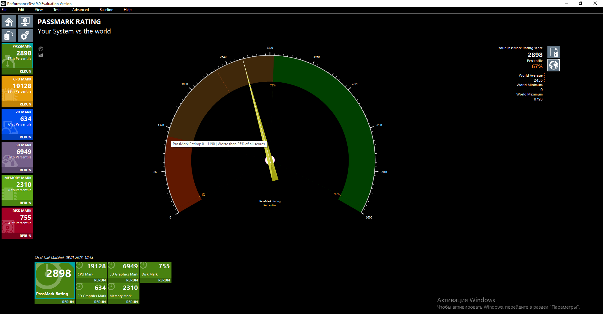
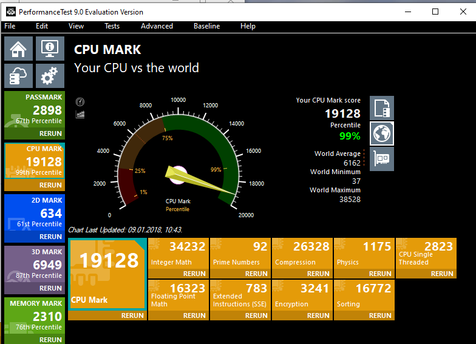
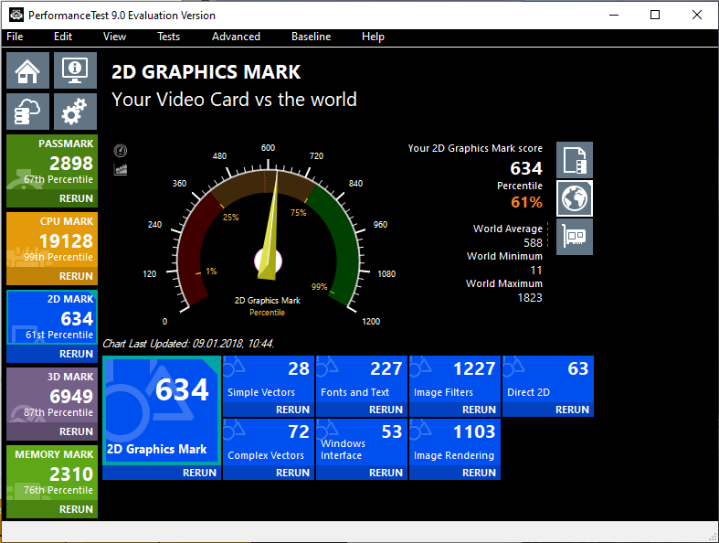
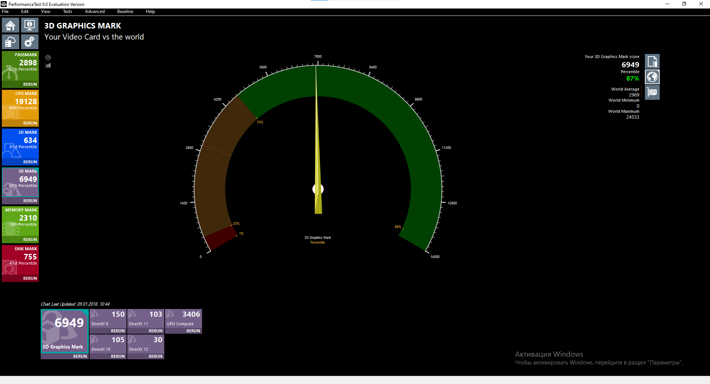
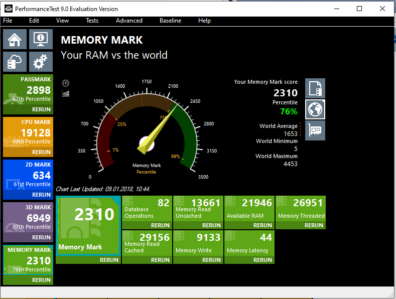
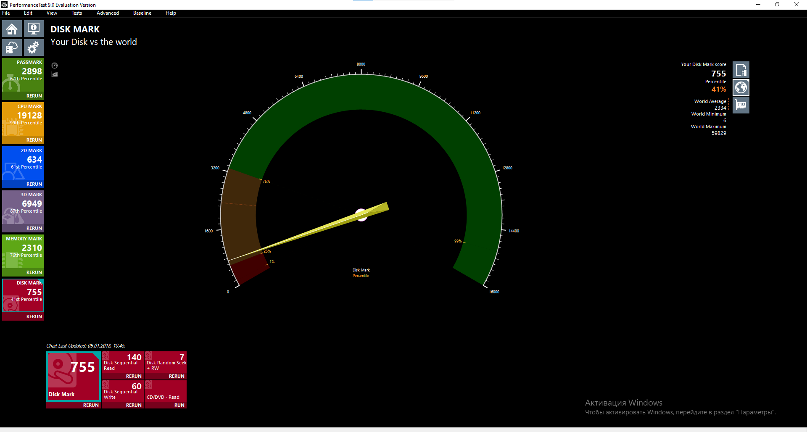

# Практическая работа №8
## Тестирование персонального компьютера с помощью утилиты Passmark Performance Test

**Цель работы:** Провести финальное тестирование стабильности системы для последующей разработки технического задания по внедрению компьютерной системы.

**Оборудование:** Учебный персональный компьютер.

**Программное обеспечение:** Passmark PerformanceTest 9.0 (Evaluation Version).

---

## Теоретические сведения

**PerformanceTest** — набор тестов, позволяющих оценить общую производительность вашего ПК по сравнению с другими компьютерами. В программу входят 27 стандартных тестов в 7 группах.

**Стандартные наборы тестов:**

| Категория | Описание |
|-----------|----------|
| **CPU Mark** | Математические операции: сжатие, шифрование, MMX/SSE, 3DNow! |
| **2D Mark** | Черчение/рисование, битовые карты, шрифты, текст, GUI-элементы |
| **3D Mark** | Трехмерная графика уровня DirectX 8.1, DirectX 9, анимация |
| **Memory Mark** | Ассигнование и доступ к скорости памяти |
| **Disk Mark** | Чтение, запись и поиск файлов на диске |

---

## Ход выполнения работы

### 1. Общие результаты тестирования

Был проведен полный комплекс тестов в программе PerformanceTest 9.0. Общие результаты представлены в виде **PassMark Rating** — интегральной оценки производительности системы.

#### PassMark Rating (общий рейтинг)

| Параметр | Результат | Процентиль |
|----------|-----------|------------|
| **PassMark Rating** | 2898.8 | 67-й процентиль |

*67-й процентиль означает, что система работает лучше, чем 67% всех протестированных компьютеров.*

---

### 2. Результаты тестов по категориям

| Категория | Результат | Процентиль | Оценка |
|-----------|-----------|------------|--------|
| **CPU Mark** | 19128.3 | 99-й | ⭐ Отлично |
| **2D Graphics Mark** | 634.5 | 61-й | ⭐ Хорошо |
| **3D Graphics Mark** | 6949.7 | 87-й | ⭐ Очень хорошо |
| **Memory Mark** | 2310.2 | 76-й | ⭐ Хорошо |
| **Disk Mark** | 755.1 | 41-й | ⭐ Средне |

---

### 3. Детальный разбор по категориям

#### 3.1 CPU Mark — 19128.3 (99-й процентиль)

| Параметр | Результат |
|----------|-----------|
| **CPU Mark** | 19128.3 |
| **World Average** | 6162 |
| **World Minimum** | 37 |
| **World Maximum** | 38528 |

**Вывод:** Процессор показывает выдающиеся результаты (99-й процентиль), что говорит о высокой производительности. Система отлично справляется с математическими вычислениями, шифрованием и многопоточными задачами.

---

#### 3.2 2D Graphics Mark — 634.5 (61-й процентиль)

| Подтест | Результат |
|---------|-----------|
| **Simple Vectors** | 28 |
| **Fonts and Text** | 227 |
| **Image Filters** | 1227 |
| **Direct 2D** | 63 |
| **Complex Vectors** | 72 |
| **Windows Interface** | 53 |
| **Image Rendering** | 1103 |

| Параметр | Результат |
|----------|-----------|
| **2D Graphics Mark** | 634.5 |
| **World Average** | 588 |
| **World Minimum** | 11 |
| **World Maximum** | 1823 |

**Вывод:** 2D-графика находится на хорошем уровне (61-й процентиль). Система хорошо справляется с отрисовкой интерфейса, текста и базовой графикой. Результат чуть выше среднего по миру (634 > 588).

---

#### 3.3 3D Graphics Mark — 6949.7 (87-й процентиль)

| Подтест | Результат |
|---------|-----------|
| **DirectX 9** | 150 |
| **DirectX 11** | 103 |
| **GPU Compute** | 3406 |

| Параметр | Результат |
|----------|-----------|
| **3D Graphics Mark** | 6949.7 |
| **World Average** | 2969 |
| **World Minimum** | 30 |
| **World Maximum** | 24533 |

**Вывод:** 3D-графика показывает высокий результат (87-й процентиль). Видеокарта GTX 1050 Ti хорошо справляется с 3D-нагрузкой и современными играми. Результат значительно выше среднего (6949 > 2969).

---

#### 3.4 Memory Mark — 2310.2 (76-й процентиль)

| Подтест | Результат |
|---------|-----------|
| **Database Operations** | 82 |
| **Memory Read Uncached** | 13661 |
| **Available RAM** | 21946 |
| **Memory Threaded** | 26951 |
| **Memory Read Cached** | 29156 |
| **Memory Write** | 9133 |
| **Memory Latency** | 44 |

| Параметр | Результат |
|----------|-----------|
| **Memory Mark** | 2310.2 |
| **World Average** | 1653 |
| **World Minimum** | 5 |
| **World Maximum** | 4453 |

**Вывод:** Память показывает хороший результат (76-й процентиль). Dual Channel DDR4-2617 работает стабильно. Результат выше среднего (2310 > 1653).

---

#### 3.5 Disk Mark — 755.1 (41-й процентиль)

| Подтест | Результат |
|---------|-----------|
| **Disk Sequential Read** | 755 |
| **Disk Sequential Write** | 60 |
| **Disk Random Seek + RW** | 140 |

| Параметр | Результат |
|----------|-----------|
| **Disk Mark** | 755.1 |
| **World Average** | 2334 |
| **World Minimum** | 6 |
| **World Maximum** | 59829 |

**Вывод:** Диск показывает средний результат (41-й процентиль). Это связано с использованием HDD вместо SSD. Результат значительно ниже среднего (755 < 2334). Это самое слабое звено системы.

---

### 4. Сравнение с мировыми показателями

| Категория | Ваш результат | World Average | Разница | Процентиль |
|-----------|---------------|---------------|---------|------------|
| **CPU Mark** | 19128 | 6162 | +12966 | 99-й |
| **2D Mark** | 634 | 588 | +46 | 61-й |
| **3D Mark** | 6949 | 2969 | +3980 | 87-й |
| **Memory Mark** | 2310 | 1653 | +657 | 76-й |
| **Disk Mark** | 755 | 2334 | -1579 | 41-й |

---

### 5. Сравнение с результатами AIDA64

| Тест | AIDA64 | PerformanceTest | Разница |
|------|--------|-----------------|---------|
| **Memory Read** | 34982 MB/s | 29156 MB/s | -5826 MB/s |
| **Memory Write** | 21245 MB/s | 9133 MB/s | -12112 MB/s |
| **Memory Latency** | 92.5 ns | 44 ns | -48.5 ns |

---

### 6. Сводная таблица результатов

| Категория | Результат | Мир. средний | Мир. мин. | Мир. макс. | Процентиль |
|-----------|-----------|--------------|-----------|------------|------------|
| **PassMark Rating** | 2898.8 | 2455 | 0 | 10793 | 67-й |
| **CPU Mark** | 19128.3 | 6162 | 37 | 38528 | 99-й |
| **2D Graphics Mark** | 634.5 | 588 | 11 | 1823 | 61-й |
| **3D Graphics Mark** | 6949.7 | 2969 | 30 | 24533 | 87-й |
| **Memory Mark** | 2310.2 | 1653 | 5 | 4453 | 76-й |
| **Disk Mark** | 755.1 | 2334 | 6 | 59829 | 41-й |

---

### 7. Общая оценка системы

| Устройство | Оценка (1-10) | Комментарий |
|------------|---------------|-------------|
| **Процессор (CPU)** | 10 | Отличная производительность (99-й процентиль) |
| **Оперативная память (RAM)** | 8 | Хорошая производительность (76-й процентиль) |
| **Видеокарта (GPU)** | 9 | Высокая производительность (87-й процентиль) |
| **Жесткий диск (HDD)** | 5 | Средняя производительность (41-й процентиль) — узкое место системы |
| **Температура** | 9 | Хороший температурный режим |
| **Общая оценка** | 8 | Система сбалансирована, но требует SSD |

---

### 8. Вывод

**Сильные стороны системы:**
- ✅ **Процессор AMD Ryzen 5 3600** — топовый результат (99-й процентиль, 19128 баллов)
- ✅ **Видеокарта GTX 1050 Ti** — хороший результат (87-й процентиль, 6949 баллов)
- ✅ **Память** — хорошая производительность (76-й процентиль, 2310 баллов)

**Слабые стороны системы:**
- ⚠️ **Жесткий диск (HDD)** — низкая производительность (41-й процентиль, 755 баллов)

**Рекомендации по улучшению:**
1. **Установка SSD-накопителя** — самый эффективный апгрейд, который кардинально ускорит загрузку системы и запуск приложений
2. **Увеличение объема ОЗУ до 32 ГБ** — для работы с тяжелыми приложениями

---

## Контрольные вопросы

### 1. Как вы считаете для каких целей может быть использована тестируемая Вами компьютерная система?

`Тестируемая система (AMD Ryzen 5 3600 + GTX 1050 Ti + 16 ГБ DDR4) является универсальным решением, подходящим для: 1) Офисной работы и работы с документами; 2) Веб-серфинга и мультимедиа (видео 4K); 3) Игр среднего уровня в разрешении 1920x1080; 4) Программирования и компиляции кода; 5) Работы с графикой и фото; 6) Учебных и лабораторных целей. Система не подходит для профессионального видеомонтажа, 3D-моделирования и тяжелых игр на высоких настройках.`

### 2. На ваш взгляд, какие бы параметры компьютерной системы можно было бы улучшить? Укажите пример.

`Основное узкое место системы — жесткий диск (41-й процентиль, 755 баллов при среднем 2334). Установка SSD-накопителя (например, Samsung 980 500 ГБ M.2 NVMe) кардинально улучшит скорость загрузки системы и запуска приложений. Также можно увеличить объем ОЗУ с 16 до 32 ГБ для работы с тяжелыми приложениями.`

### 3. Предложите свой вариант компьютерной системы для образовательного процесса в кабинете 403. Напишите полные характеристики с указанием стоимости каждого устройства.

| Компонент | Характеристика | Стоимость (прим.) |
|-----------|----------------|-------------------|
| **Процессор** | Intel Core i5-12400 (2.5 ГГц, 6 ядер) | 14 000 руб. |
| **Материнская плата** | ASUS PRIME B760M-K | 8 500 руб. |
| **Оперативная память** | 2x8 ГБ DDR4-3200 Kingston Fury | 5 500 руб. |
| **SSD накопитель** | Samsung 980 500 ГБ M.2 NVMe | 5 500 руб. |
| **HDD накопитель** | 1 ТБ SATA 3.0 | 4 000 руб. |
| **Блок питания** | 600W (в комплекте с корпусом) | - |
| **Корпус** | ATX Mid Tower | 5 000 руб. |
| **Монитор** | 23.8" Full HD IPS | 10 000 руб. |
| **Клавиатура + Мышь** | Комплект | 1 500 руб. |
| **Итого:** | | **≈ 54 000 руб.** |